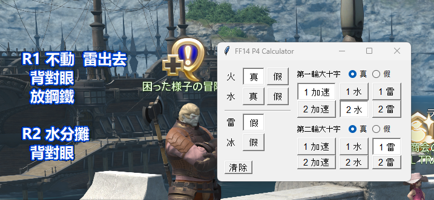

# Introduction

A simple project to record UMAD P4-mechanics and calculate what it actually means in Chinese.

- It is for study purpose to get familiarized myself with the mechanics;

- It should not be brought into the game directly, instead you should embrace the `/e` and macro-system FF14 provided to enjoy the game.

Happy coding and best wishes for your UMAD journey.

Now updated to:

