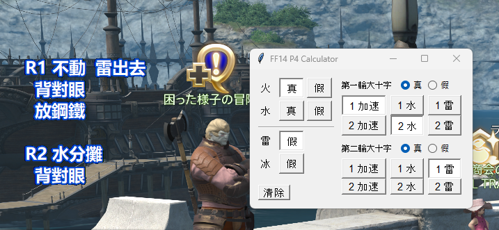
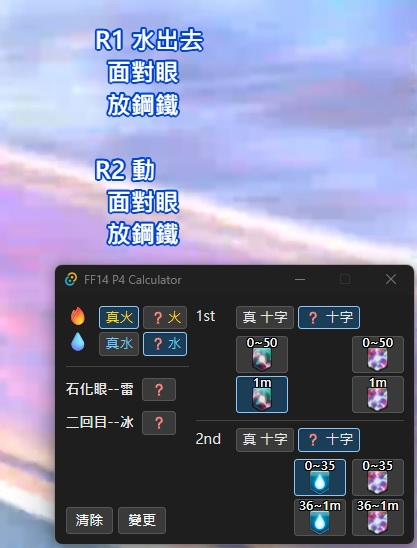

# Introduction

## Python Version

A simple project to record UMAD P4-mechanics and calculate what it actually means in Chinese.

- It is for study purpose to get familiarized myself with the mechanics;

- It should not be brought into the game directly, instead you should embrace the `/e` and macro-system FF14 provided to enjoy the game.

Happy coding and best wishes for your UMAD journey.

Now updated to:

## Tauri Version

The same application is revamped into Tauri for better customizable UI:

This is also downloadable in the release page of this github project.

### Features Added

#### 2026-09-07

Add step by step in game-menu

https://github.com/user-attachments/assets/fed83eb5-5859-4319-8bae-b74bb2523ce5

#### 2026-09-20

- Add TTS for mechanics reporting https://github.com/machingclee/2026-07-UMAD-P4-Calculator/releases/tag/v0.0.8
- Add `PostNamazu` support, for now it only `/e` messages, but it already servers as a decent trigger for many other application, left as study in the future.
